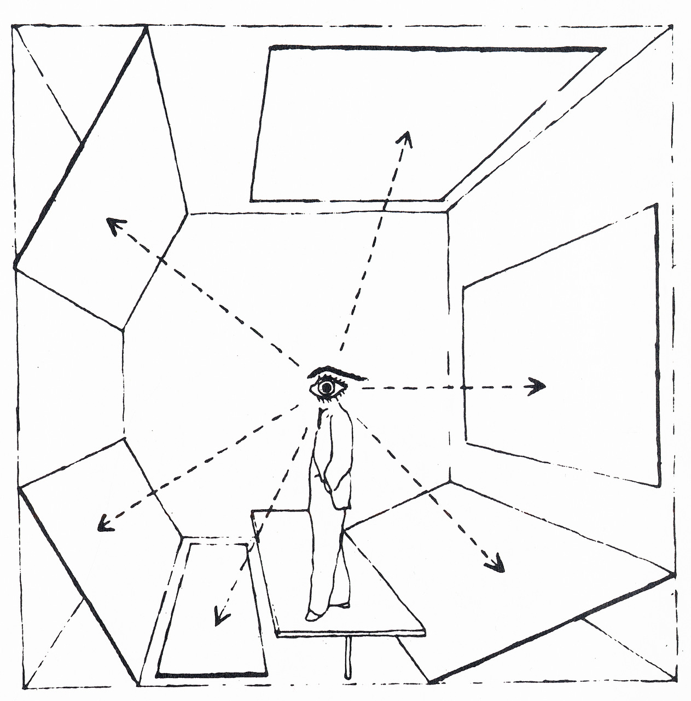
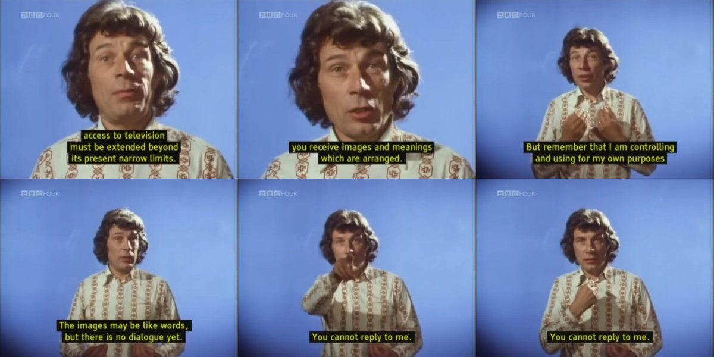

## Ways of Seeing (Part 1) by John Berger

 This week's reading was a video by John Berger made in 1972 for the BBC.
 
 The video is about.... well.... Ways of Seeing. Meaning that how we are presented information is just as important as the actual content of the information. In the beginning of the video the author states that the videos are about "questioning the assumptions made about the tradition of European painting from 1400 to 1900". It makes it sound like they video would be about art criticism or art history, but it's actually about how we, in the 20th/21st century, look at these paintings.

The idea of thinking about what is around an image as we look at it is really powerful and made me stop and ponder. If in the 1970s we already had all of these questions regarding what was around an image that we looked at in our TVs, imagine today. There are so many ways in which images and videos are surround by other content, and today, they also surround us, arriving at unimaginable speeds and quantities.

This reminded me of Herbert Bayer's "Diagram of Field of Vision" from the Bauhaus school in the early 20th century:

This also makes me think about social media interfaces and how they make it easier for us to share media, but at the same time, they are responsible for providing this background/context that surrounds our images: "The images come to you. You do not go to them. The days of pilgrimage are over... It has become information".

The discussion about the paintings by Leonardo Da Vinci and how art is tied to money through this idea of uniqueness, seems really current, given al of the money involved with NFTs.

The whole idea of thinking about how images are presented, how they move, what's around them, what accompanies them, etc is very much related to programming, where we have complete freedom of choosing how we present information, and an infinite number of techniques and technologies for doing so. Even if not specific to images, how we edit, copy, paste, transform, remix and present information is very much present as a concern when we program any kind of media.

This video made me think of some of the readings that we've done that say that no technology and no data is neutral; there's always some bias. And it makes me think that technology has really expanded and accelerated some of the mechanisms for these biases.

Just as a footnote: I like how he shows some images of the studio where they are filming, as if to show that the video also has a context, a place of origin and a surround.

Instead of finding one quote, I made a collage using some of the phrases I liked. They've been re-arranged in a different in which they were presented:

